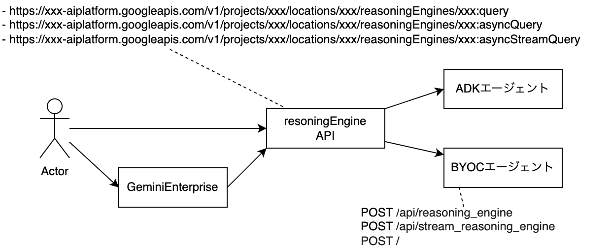
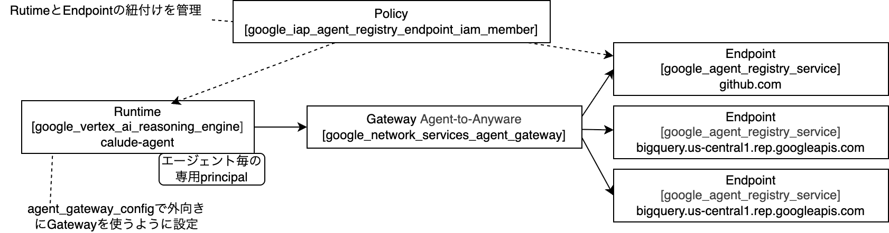
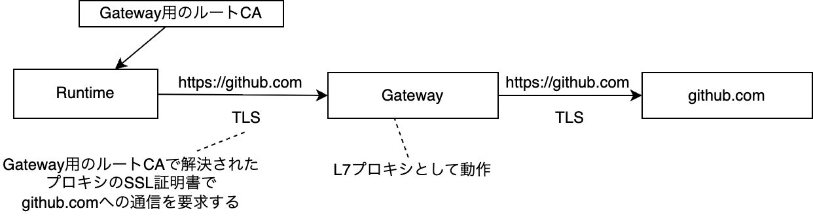

# Google Cloud Agent PlatformでBYOCエージェントを動かす

独自コンテナのエージェントを動かす機構として、Google Cloud Agent Platformで利用可能な機能について調べた。

- ホスティング機能
- セッション管理機能

## Agent Runtime エージェントのホスティング機能

エージェントをホスティングすることができる。ホスティングするエージェントには以下の種類がある。

- Google Agent Development Kit（コードのアップロード）
- LangChain等のサードパーティフレームワーク（コードのアップロード）
- 独自コンテナ(BYOC: Bring your own container)

エージェント側の呼び出される仕様はもちろんフレームワークによって異なる。
BYOCAエージェントはREST APIとして呼び出しを受ける

エージェントを呼ぶときには、共通のGoogle CloudのAPIを呼び、各フレームワークを透過的に使える



ホスティングされたコンテナの実行は、今までのCloud Run等とはまた別の環境で実行される。
基本共有環境っぽい。

## 呼び出しの種類

呼び出し側には、4+1種類がある

- 通常クエリ(15分以内)
  - query
  - stream_query
  - async_query
  - async_stream_query
- 長時間実行クエリ(8時間以内)
  - async_query

フレームワークによって利用できるものが異なる。
BYOCエージェントにおいては、queryとasync_queryのどちらも、同じ/api/reasoning_engineにPOSTされ、同期的に処理すれば良さそうである。

通常クエリと、長時間実行クエリに分かれており、通常クエリは最大15分しか動作できない。

### 通常クエリ

通常クエリでは、APIのレスポンス自体に、エージェントへのリクエスト、エージェントからのレスポンスが含まれている。

```
$curl \
-H "Authorization: Bearer $(gcloud auth print-access-token)" \
-H "Content-Type: application/json" \
https://LOCATION-aiplatform.googleapis.com/v1/projects/PROJECT_ID/locations/LOCATION/reasoningEngines/RESOURCE_ID:query -d '{
  "class_method": "query",
  "input": {
    "input": "What is the exchange rate from US dollars to Swedish Krona today?"
  }
}'
```

BYOCコンテナ側では、以下のエンドポイントを実装する。片方でも良い。このエンドポイントは変更することもできる。

-	POST /api/reasoning_engine
-	POST /api/stream_reasoning_engine

### 長時間実行クエリ

長時間実行クエリは、リクエスト、レスポンスはGCSにJSONファイルを置き、GCSのパスを指定して実行する。

```
$curl \
-H "Authorization: Bearer $(gcloud auth print-access-token)" \
-H "Content-Type: application/json" \
https://LOCATION-aiplatform.googleapis.com/v1beta1/projects/PROJECT_ID/locations/LOCATION/reasoningEngines/RESOURCE_ID:asyncQuery -d \
'{
  "input_gcs_uri": "gs://GCS_BUCKET_NAME/INPUT_FILE",
  "output_gcs_uri": "gs://GCS_BUCKET_NAME/OUTPUT_FILE"
}'
```

BYOCコンテナ側では、GCSのファイルが展開され、REST APIには展開されているJSONがPOSTされる。
つまり、GCSの仕様を知る必要はない。
ただし、BYOCエージェントのPrincipalにGCSの読み書き権限が必要である。

BYOCコンテナ側では、以下のエンドポイントを実装する。
この`POST /`を使う仕様がドキュメント化されておらず、Googleに問い合わせて知ることができた。

-	POST / (/api/reasoning_engineと同じ仕様)

### コンテナのGCP権限

エージェントには2種類のIAMの設定がある

- Service Account
- Agent Identity

Agent Identityは、エージェントを作ると払い出されるプリンシパルである。

```
principal://agents.global.org-PROJECT_NUMBER.system.id.goog/resources/aiplatform/projects/PROJECT_NUMBER/locations/us-central1/reasoningEngines/ENGINE_ID
```

これで権限を付与していけば良い

### 他に必要なもの

Artifact Registryの権限をプロジェクト単位の権限に付与する必要がある

```
serviceAccount:service-${data.google_project.current.number}@gcp-sa-aiplatform-re.iam.gserviceaccount.com
```

## Agent Gatewayによる外向き通信の許可

エージェントが利用するリソースはAgent Registryに登録されるが、外部アクセス先も同様に登録される。
Agent GatewayリソースをAgent Runtimeにセットすると、ルーティングが始まる（VPCのようにネットワーク下に入れたイメージ）。

- Agent Runtime: エージェント
- Agent Registry: SkillとかMCPとか接続先とか、リソースを登録する
  - Skills
  - MCP Servers
  - Endpoints: 外部接続先
- Agent Gateway: Agent Runtimeからの通信を制御する
  - Agent Runtimeの「外向き用(Agent-to-Anywhere)」「内向き用」でリソースが別
  - 「Policyを適用する」「監査のみを適用する」とある
- IAPが使える認可拡張機能を有効にする
  - Agent Runtimeのprincipalを使ってポリシーを解決できるように使う必要がある
  - Gatewayに適用するように設定が必要
  - IAPなので本来はユーザの権限を使って認可ができるやつだと思われるが、まだユーザの認可の機能が設定できそうなところが見えない

### 設定の構成



### 実際の通信



L7プロキシとして動作する。
クライアント側でSSL証明書のhashレベルの検証をしていたらアウトになるが、多分大丈夫。

### コンソールで確認できるところ

- Agent Runtime
  - 管理->Agent Registry->Agents
    - ランタイムに Agent Runtime を選択
  - スケール->デプロイ
    - 構成に「コンテナイメージURI」「Agent Gatewayの設定」がある
    - どのくらいCPU使っているかのモニタリング
- Agent Gateway
  - 管理->Gateway
  - ほぼここには設定がない
- Endpoint（アクセス先）
  - 管理->Agent Registry->Endpoints
- Policy（アクセス制御）
  - 管理->Policies→IAM許可
  - ENGINE_IDと、ENDPOINT_IDを設定する

### 認可拡張機能

GCPのこれにGatewayが依存している

- Terraform google_network_services_authz_extension
  - 認可拡張機能リソース
  - IAPで認可ができるようにする拡張機能
  - Gatewayの機能はこれに依存している
- Terraform google_network_security_authz_policy
  - Gatewayに認可拡張機能をアタッチする

### Agent Gatewayの実体


## セッション管理機能 SessionStore

セッション管理用のデータストアがある。

要するにJSONを入れられる追記型データストア。Append、List、Get、Deleteができる。

「セッション」という管理のまとまりがあり、その中に「イベント」を追加していく。

ADKだと自動で使われるが、APIとしても提供されているので、使うことができる。

## MCP Server

実際に試していない。

Agent Runtime、Gemini Enterpriseから使われるMCP Serverを登録する。

外部エンドポイントの仲介をするので、Policyが適用できるが、外部エンドポイントに対する認証を仲介してくれるのかはわからん。

チュートリアルは、Cloud Runで動したサーバを登録しようみたいになってた。

## pricing

- Agent Runtime
  - vCPU $0.085/vCPU-h
  - RAM $0.009/GiB-h
  - e2-standard-2相当で $0.242/h
  - 他
    - Storage $0.000410959/GiB-h
- Agent Gateway, Agent Registry
  - 15000APIコール毎に $0.085
  - npm installとかしない限りほぼタダ
- Session
  - 容量課金 $0.30/GiB
  - リクエスト課金 300M回ごとに $0.085
  - ほぼタダ

参考

- e2-standard-2
  - $0.06701142/h
